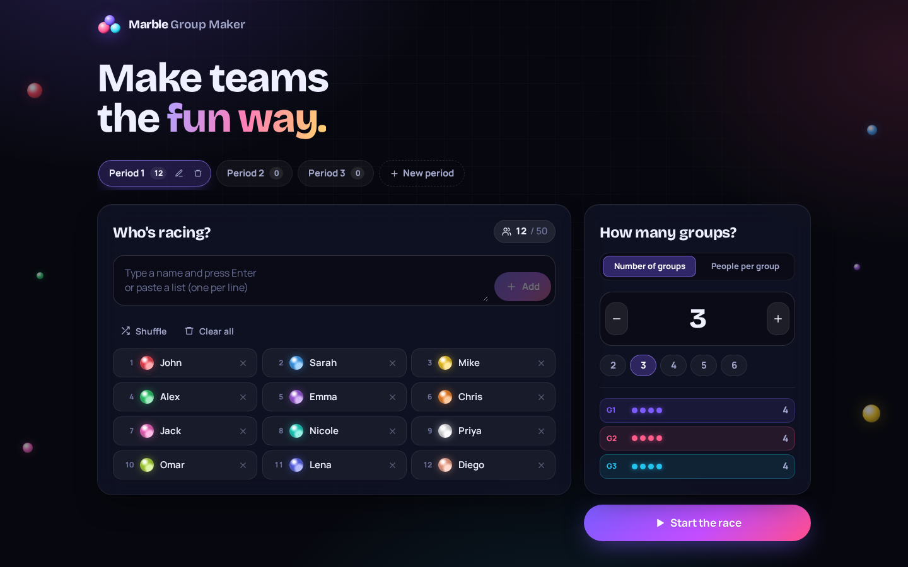
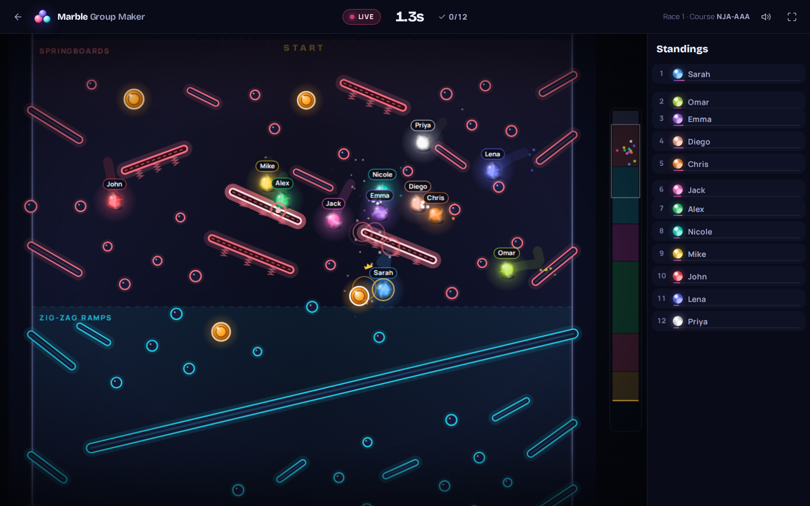
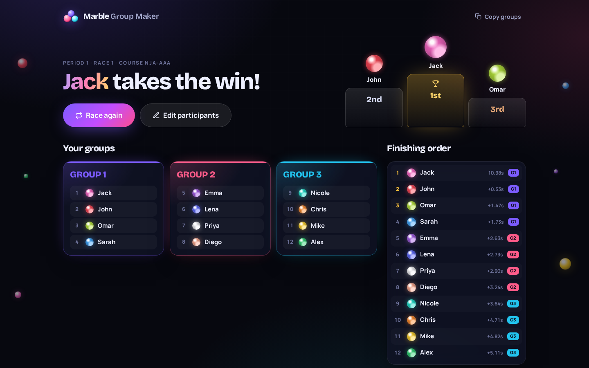

# Marble Group Maker

Split any group of people into teams with a fun, **~20-second physics marble race**.

Paste a list of names, choose how many groups you want, and press start. Everyone becomes a colored marble, a brand-new race course is generated, and the order in which the marbles cross the finish line decides the groups. Great for classrooms, parties, club meetings, or game night.



| The race | The results |
| --- | --- |
|  |  |

---

## How to use it

1. **Pick a class.** The tabs at the top hold your saved classes – *Period 1*, *Period 2* and so on. Each one keeps its own list of names, group setting and last results. Click **New period** to add one, click the active tab (or its pencil) to rename it, and use the bin to delete it (you can undo).
2. **Add people.** Type a name and press <kbd>Enter</kbd>, or paste a whole list (one name per line) – everyone is added at once. Commas and numbered lists (`1. John`) work too. Duplicate names get a number (`Alex 2`) so every marble stays unique.
3. **Choose the groups:** either the **number of groups**, or **people per group** (e.g. "groups of 4"). Use the − / + buttons or the quick picks; a preview shows how big each group will be.
4. **Shuffle** the starting grid if you like, then press **Start the race** (or <kbd>Ctrl</kbd>+<kbd>Enter</kbd>).
5. Watch the course preview, the **3 – 2 – 1 – GO!** countdown, and the race. Click a name in the standings to follow that marble. The ⛶ button goes fullscreen (handy for a projector).
6. The results show the **podium**, the **group cards** and the **full finishing order**. Use **Race again** for a new course with the same people, **Edit participants** to change the list, or **Copy groups** to paste them into a chat or document.

**How groups are formed:** the finishing order is cut into consecutive groups. With 12 people and 3 groups, places 1–4 are Group 1, places 5–8 Group 2 and places 9–12 Group 3. If it doesn't divide evenly, sizes differ by at most one (10 people in 3 groups → 4, 3, 3). With "people per group", no group is bigger than the number you chose (10 people in groups of 4 → 4, 3, 3).

Your classes, names, group settings and last results are saved in your browser, so refreshing the page (or coming back tomorrow) loses nothing. Nothing is sent to any server. Saved data lives in the browser you use – a different computer or browser starts empty.

---

## Run it on your computer

You need [Node.js](https://nodejs.org/) (version 22 or newer). Then, in a terminal inside this folder:

```bash
npm install      # download the libraries (only needed once)
npm run dev      # start the app
```

Open the address it prints (usually <http://localhost:5173>) in your browser.

To make a production version (a folder of plain files you can put on any web host):

```bash
npm run build    # creates the "dist" folder
npm run preview  # try the production build locally
```

### Put it online for free (GitHub Pages)

This repository includes a ready-made workflow. One-time setup: on GitHub, open **Settings → Pages** and set **Source** to **GitHub Actions**.

From then on the site redeploys automatically every time `main` changes, and your app is live at `https://<your-username>.github.io/marble-group-maker/`. You can also start a deploy by hand from the **Actions** tab (**Deploy to GitHub Pages → Run workflow**).

### How changes get published (automatic)

Changes made by Claude arrive as pull requests from branches named `claude/...`. They merge themselves – no manual review needed:

1. The pull request runs **CI**: lint, typecheck, unit tests, a production build, and the browser tests.
2. When CI passes, the **Auto-merge Claude PRs** workflow merges the pull request into `main`. It only does this if:
   - the branch starts with `claude/` and lives in this repository (never a fork),
   - CI passed on the exact commit being merged, and every other check on it passed too,
   - the pull request is open, not a draft, and targets `main`.
3. It then starts **Deploy to GitHub Pages**, so the live site updates a minute later.

If CI fails, nothing is merged; the pull request just waits for a fix. One deliberate exception: pull requests that change the automation or CI themselves (anything in `.github/workflows/`) are never merged automatically – the workflow leaves a comment asking you to merge by hand, so the safety checks can't be weakened without you seeing it. Pull requests from any other branch are not touched and merge the normal way.

---

## How it works (in plain language)

### A real physics race – not a fake animation
The race uses [Matter.js](https://brm.io/matter-js/), a physics engine that simulates gravity, bouncing and collisions. Every marble is a physical object. **Nothing is decided in advance:** the app simply records the exact moment each marble crosses the finish line, and that order becomes the result. You can see it in the code: `src/game/physics/raceSimulation.ts`.

### A new course every race
Each race gets a fresh random "seed" (a number) that the course generator uses to build a unique track from building blocks:

| Section | What happens |
| --- | --- |
| Peg forest | Marbles pinball through rows of pegs |
| Waterfall | A staggered wall of slanted plates marbles tumble down |
| Trampoline park | Springy bars that launch marbles into the air |
| Switchbacks (zig-zag ramps) | Long ramps, sometimes with a gap that slow marbles fall through |
| Mud slide | Sticky patches slow marbles down |
| Funnel / double drain | Everyone squeezes through one or two openings |
| Bumper bash | Springy bumpers kick marbles around |
| Spin cycle | Funnel shelves drop marbles onto rotating paddle wheels |
| Wrecking balls | Funnel shelves drop marbles past swinging pendulums |
| Sliding doors | Funnel shelves drop marbles onto shuttling bars |
| Free fall | A drop with deflectors on the walls |
| The split | The track divides into two lanes with different obstacles, then merges again |
| Final funnel | A last gauntlet of bumpers, then the checkered finish line |

**No lucky free rides.** After a course is built, the generator scans every column of it for open shafts a marble could fall straight down, and plugs them with pegs, slanted plates, small bumpers, wall bumps and deflectors. Moving obstacles sit under funnel shelves, so every marble has to go through them. The physics also records how far each marble ever falls without touching anything: the typical marble's longest untouched drop is about a third of a screen height.

Random doesn't mean chaotic: the generator follows **playability rules** so a course can never trap a marble – every gap is wider than the biggest marble, every ramp slopes downhill, moving parts get extra room, and a validator double-checks the finished course (and rebuilds it if anything is off). Bumpers and trampolines kick any marble that comes to rest on them, like in pinball. As a final safety net, a marble that hasn't moved for about a second (for example, balanced perfectly on top of a peg) gets a small pop toward the open middle of the course. In the stress test – 120 complete races with 2 to 50 marbles, about 2,450 marbles in total – every race finished and no marble ever left the course; that little pop was needed for about 1 marble in 25.

### About 20 seconds
The course generator estimates how long each section takes (these estimates were measured from hundreds of simulated races) and adds sections until the course is about 20 seconds long. While you watch, the screen can play the race slightly faster or slower (like fast-forwarding a video) to land close to 20 seconds, and once most marbles have finished, the last stragglers are shown in fast-forward. **This never changes what happens in the race** – the physics always runs in the same fixed time steps.

### Watching the race
- The camera follows the leading pack; a minimap on the right shows the whole course.
- The live standings update as marbles overtake each other, and show each finisher's group straight away.
- Effects are kept subtle: glowing marbles, trails, sparks on impacts, small screen shakes on big hits, confetti at the finish, and a slow-motion "photo finish" when two marbles arrive side by side.
- Sound effects are generated in the browser and can be muted with the speaker button.

---

## Project structure

```
src/
  App.tsx                     Screens and app state (setup → race → results)
  storage.ts                  Saved classes (periods) in the browser
  components/                 The three screens and small UI pieces
  game/
    track/generator.ts        Builds a random but playable course
    track/validate.ts         Double-checks every course is playable
    track/coverage.ts         Finds open shafts where a marble could fall untouched
    physics/raceSimulation.ts The physics race (Matter.js) and finish-line detection
    raceController.ts         Race phases, pacing, camera and effects
    render/                   Canvas drawing: course, marbles, particles, minimap
    grouping.ts               Turns the finishing order into groups
    names.ts                  Cleans up pasted names
    colors.ts                 Distinct marble colors (two-tone after 20 people)
tests/unit/                   Fast automated tests (logic + full headless races)
tests/sim/                    Long stress test: many complete races
e2e/                          Browser tests that click through the real app
```

## Tests

```bash
npm test          # unit tests, including complete races simulated without graphics
npm run simulate  # stress test: 120 full races with 2–50 marbles
npm run test:e2e  # browser tests (needs Playwright's Chromium: npx playwright install chromium)
npm run lint      # code style checks
npm run typecheck # TypeScript checks
```

The browser tests cover: pasting names, invalid setups, 4 people / 2 groups (checking the race takes about 20 seconds), 10 people / 3 groups (uneven), 24 people / 5 groups, "people per group", several races in a row with **Race again** (each on a different course), editing participants, saved class periods (switching, renaming, deleting with undo, surviving a refresh), upgrading data saved by the previous version, refreshing the page, keyboard shortcuts, the phone layout, and that there are no errors in the browser console.

## Tech

React 19 · TypeScript · Vite · Matter.js · Canvas 2D · Vitest · Playwright. Everything runs in the browser; there is no backend.
